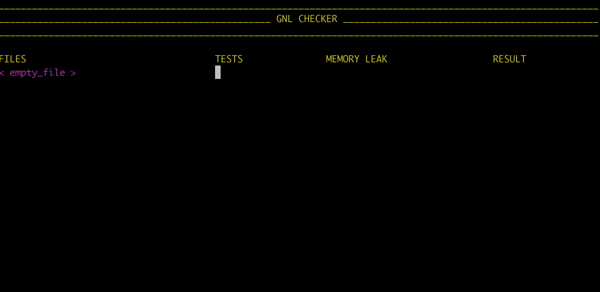

#  GET_NEXT_LINE_CHECKER

<p align="center">
	
</p>

Test your own get_next_line.c (basics tests + check for memory leak using Valgrind + multi_fd test)

Your gnl folder and the gnl_checker folder must be in the same directory. OR you can edit the variable $DIR in the script...

```bash
git clone https://github.com/busshi/gnl_checker.git && cd gnl_checker && ./gnl_checker.sh
```

Go into the gnl_checker directory and run ./gnl_checker.sh

Notes :
```bash
./gnl_checker.sh bonus # Test bonus
./gnl_checker.sh all # Test all
```
